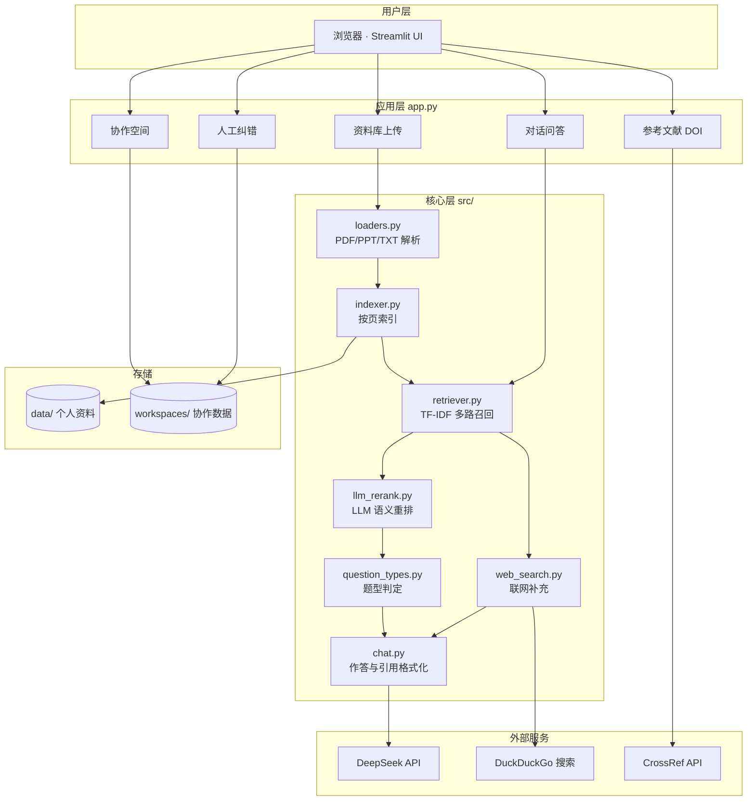
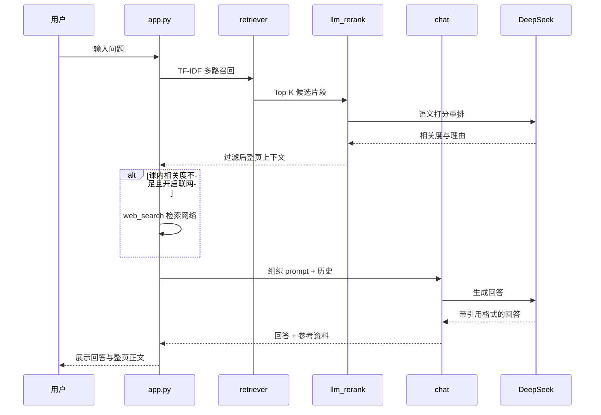
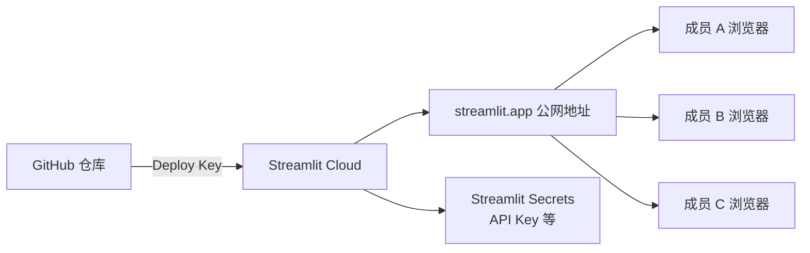

# 系统架构说明（成员 B 填写）

> B 可据此图用 draw.io / ProcessOn 重绘为 `architecture.png` 放入答辩 PPT。  
> 下方 Mermaid 图可在 GitHub 或支持 Mermaid 的编辑器中直接预览。

---

## 总体架构

---

## 问答链路（单次提问）

---

## 模块说明表 【B 可补充】

| 模块 | 文件 | 职责 |
|------|------|------|
| 界面 | `app.py` | Streamlit 双栏布局、上传、对话、协作 |
| 加载 | `loaders.py` | PDF/PPT/TXT 解析，按页元数据 |
| 索引 | `indexer.py` | 多文件累积索引、重建 |
| 检索 | `retriever.py` | TF-IDF、多 query 召回、按页合并 |
| 重排 | `llm_rerank.py` | LLM 过滤跑题片段 |
| 对话 | `chat.py` | Prompt 策略、引用格式化 |
| 协作 | `workspace.py` | 邀请码、共享目录、消息同步 |
| 纠错 | `corrections.py` | 按页修正并参与检索 |
| 联网 | `web_search.py` | 课内不足时补充网络来源 |

---

## 部署架构（可选，答辩用）

填写说明：若已部署，在图中标注实际 App 地址。
